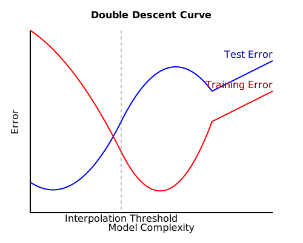

# Understanding and Interpreting Deep Networks

## 1. Double Descent Phenomenon

The double descent phenomenon challenges the classical understanding of the bias-variance tradeoff in machine learning.

### Classical Understanding:
In traditional machine learning theory, as model complexity increases:
- Training error continuously decreases
- Test error follows a U-shaped curve: it first decreases (as bias decreases) and then increases (as variance increases)

### Double Descent:
Recent research has shown that in modern machine learning, particularly with deep neural networks, there's a more complex behavior:

Key aspects of double descent:
1. Initial descent: As in classical theory, test error first decreases as model complexity increases.
2. Interpolation threshold: At a critical point where model capacity is just sufficient to fit the training data perfectly, test error spikes.
3. Second descent: Beyond this point, as model complexity continues to increase, test error descends again, often below the initial minimum.

This phenomenon has been observed in various settings:
- Increasing network parameters
- Increasing training time
- Increasing dataset size

### Key research papers:
1. Belkin, M., Hsu, D., Ma, S., & Mandal, S. (2019). "Reconciling modern machine-learning practice and the classical bias–variance trade-off". Proceedings of the National Academy of Sciences, 116(32), 15849-15854.
   URL: https://www.pnas.org/content/116/32/15849

2. Nakkiran, P., Kaplun, G., Bansal, Y., Yang, T., Barak, B., & Sutskever, I. (2021). "Deep double descent: Where bigger models and more data hurt". Journal of Statistical Mechanics: Theory and Experiment, 2021(12), 124003.
   URL: https://iopscience.iop.org/article/10.1088/1742-5468/ac3a74

### Implications:
- Challenges traditional wisdom about model selection and regularization
- Suggests that in some cases, larger models may generalize better
- Raises questions about the nature of generalization in deep learning

## 2. Model Visualization Techniques

Model visualization techniques aim to understand what neural networks have learned and how they make decisions. These techniques can be broadly categorized into several approaches:

### a) Network Stimulation:

#### i. Natural Input Stimuli Retrieval:
   - Find inputs from the dataset that maximally activate specific neurons or classes
   - Useful for understanding what features the network is using for classification

#### ii. Activation Maximization:
   - Generate artificial inputs that maximize activation for specific neurons or classes
   - Can reveal the "ideal" input for a given neuron or class

Key paper:
Olah, C., Mordvintsev, A., & Schubert, L. (2017). "Feature Visualization". Distill.
URL: https://distill.pub/2017/feature-visualization/

### b) Visualizing Network Neurons:

#### i. Unsupervised Sparse AutoEncoder:
   - Train an autoencoder on a large dataset of unlabeled images
   - Visualize the features learned by hidden layers

Key paper:
Le, Q. V., Ranzato, M. A., Monga, R., Devin, M., Chen, K., Corrado, G. S., ... & Ng, A. Y. (2012). "Building high-level features using large scale unsupervised learning". In Proceedings of the 29th International Conference on Machine Learning (ICML-12) (pp. 81-88).

#### ii. Multi-model activations:
   - Cluster inputs that activate the same neuron
   - Visualize different types of features learned by each neuron

Key paper:
Nguyen, A., Yosinski, J., & Clune, J. (2016). "Multifaceted feature visualization: Uncovering the different types of features learned by each neuron in deep neural networks". arXiv preprint arXiv:1602.03616.

### c) GAN Dissection:
   - Identify units in generative models responsible for generating specific objects or concepts
   - Allow for manipulation of generated images by intervening on specific units

Key paper:
Bau, D., Zhu, J. Y., Strobelt, H., Bolei, Z., Tenenbaum, J. B., Freeman, W. T., & Torralba, A. (2019). "Gan dissection: Visualizing and understanding generative adversarial networks". arXiv preprint arXiv:1811.10597.

## 3. Model Translation

Model translation aims to convert complex models (like deep neural networks) into more interpretable models (like decision trees) while maintaining as much of the original model's performance as possible.

### Motivation:
- Neural networks are powerful but often seen as "black boxes"
- Decision trees and rule-based systems are more easily interpretable by humans
- Regulatory requirements may demand more interpretable models in certain domains

### Approaches:
#### a) Distillation:
   - Train a simpler model (student) to mimic the behavior of a complex model (teacher)
   - The student model can be a decision tree or other interpretable model

#### b) Rule extraction:
   - Derive logical rules that approximate the behavior of the neural network
   - These rules can be in the form of if-then statements or decision trees

### Key papers:
1. Frosst, N., & Hinton, G. (2017). "Distilling a neural network into a soft decision tree". arXiv preprint arXiv:1711.09784.

2. Bastani, O., Kim, C., & Bastani, H. (2017). "Interpreting blackbox models via model extraction". arXiv preprint arXiv:1705.08504.

### Challenges:
- Balancing fidelity to the original model with interpretability
- Handling complex decision boundaries that may not be easily represented by simpler models
- Scaling to high-dimensional input spaces

## 4. Decision Explanation

Decision explanation focuses on providing understandable reasons for individual predictions made by AI models.

### Motivation:
#### a) Trust in AI systems:
   - Users need to understand why a system made a particular decision, especially in critical applications like healthcare or finance

#### b) Scientific discovery:
   - Explanations can lead to new insights in fields where AI is applied (e.g., drug discovery, astrophysics)

#### c) Human-AI collaboration:
   - Clear explanations enable more effective teamwork between humans and AI systems

#### d) Regulatory compliance:
   - Laws like GDPR include a "right to explanation" for automated decisions

### Types of Explanations:

#### a) Local Interpretability:
   - Explain individual predictions rather than the entire model
   - Example: LIME (Local Interpretable Model-agnostic Explanations)

Key paper:
Ribeiro, M. T., Singh, S., & Guestrin, C. (2016). "Why should I trust you?: Explaining the predictions of any classifier". In Proceedings of the 22nd ACM SIGKDD international conference on knowledge discovery and data mining (pp. 1135-1144).

#### b) Feature Attribution:
   - Assign importance scores to input features for a particular prediction
   - Examples: SHAP (SHapley Additive exPlanations), Integrated Gradients

Key papers:
1. Lundberg, S. M., & Lee, S. I. (2017). "A unified approach to interpreting model predictions". In Advances in neural information processing systems (pp. 4765-4774).

2. Sundararajan, M., Taly, A., & Yan, Q. (2017). "Axiomatic attribution for deep networks". In Proceedings of the 34th International Conference on Machine Learning-Volume 70 (pp. 3319-3328).

#### c) Counterfactual Explanations:
   - Provide the smallest change to the input that would result in a different prediction
   - Useful for understanding decision boundaries and actionable feedback

Key paper:
Wachter, S., Mittelstadt, B., & Russell, C. (2017). "Counterfactual explanations without opening the black box: Automated decisions and the GDPR". Harvard Journal of Law & Technology, 31(2), 841-887.

#### d) Example-Based Explanations:
   - Provide similar examples from the training set to explain a prediction
   - Can be more intuitive for non-expert users

Key paper:
Koh, P. W., & Liang, P. (2017). "Understanding black-box predictions via influence functions". In International Conference on Machine Learning (pp. 1885-1894).

### Challenges in Explanation:
- Faithfulness: Ensuring explanations accurately reflect the model's decision process
- Stability: Similar inputs should have similar explanations
- Human-interpretability: Balancing completeness with simplicity
- Causal vs. correlational: Distinguishing between causal factors and mere correlations
